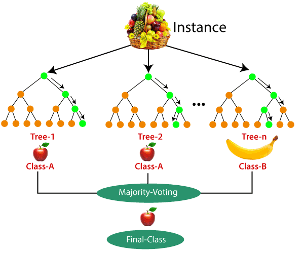

# Random Forest

### What is Random Forest?

Random Forest is an ensemble learning method primarily used for classification and regression tasks. It builds multiple decision trees and combines their predictions to make more accurate and robust predictions.



#### Key Concepts:

- **Decision Trees**: A decision tree is a flowchart-like structure used for making decisions. It splits data at each node based on feature values to make a decision. In classification, it assigns class labels to data points, and in regression, it assigns continuous values.
  
- **Ensemble Method**: Random Forest is an ensemble method, meaning it uses multiple decision trees to make predictions. By combining multiple models, Random Forest reduces the risk of overfitting and increases the model's generalization ability.

- **Bootstrap Sampling (Bagging)**: For each tree in the forest, a random subset of the data (with replacement) is selected. This technique is known as **bootstrap sampling**. This ensures that each tree sees slightly different data, which reduces overfitting.

- **Random Feature Selection**: When splitting nodes in each decision tree, instead of considering all features, only a random subset of features is considered. This increases the diversity of the trees and helps reduce correlation between them.

- **Majority Voting (for Classification)**: When making predictions, each tree casts a vote for a class, and the class with the most votes is chosen as the final prediction.

- **Averaging (for Regression)**: For regression tasks, the final prediction is the average of the predictions made by each tree.

### How Random Forest Works:

1. **Data Sampling**:
   - Random Forest creates several bootstrap samples (random subsets of the data with replacement).
   - Each decision tree is trained on a different subset of the data.

2. **Tree Growth**:
   - Each decision tree is grown to its full depth, with no pruning.
   - At each node, instead of considering all features, only a random subset of features is evaluated to find the best split.

3. **Prediction**:
   - **For Classification**: The class predicted by the majority of the trees is taken as the final output.
   - **For Regression**: The prediction is the average of the outputs from all the trees.

### Why Random Forest Works Well:

- **Reduces Overfitting**: By combining the results of multiple trees, Random Forest helps in reducing the overfitting seen in individual decision trees.
- **Handles Non-linearity**: Random Forest can model complex relationships because each tree captures different patterns in the data.
- **Robust to Noise**: Since each tree is trained on a different subset of the data and features, Random Forest is less sensitive to noise and outliers.

### Estimators in Random Forest:

In the context of Random Forest, an **estimator** is any machine learning model that can be trained on data and make predictions. Each individual decision tree in the Random Forest is an estimator. The RandomForest model itself is also an estimator that aggregates the predictions from the decision tree estimators.

- **`fit()`** method: Used to train the model.
- **`predict()`** method: Used to make predictions based on the trained model.

In **scikit-learn**, the Random Forest model is implemented in classes such as:
- **`RandomForestClassifier`** (for classification tasks)
- **`RandomForestRegressor`** (for regression tasks)

#### Example of Random Forest in Scikit-learn:

```python
from sklearn.ensemble import RandomForestClassifier

# Instantiate RandomForest model
rf = RandomForestClassifier(n_estimators=100, random_state=42)

# Train the model using training data
rf.fit(X_train, y_train)

# Make predictions on the test set
y_pred = rf.predict(X_test)
